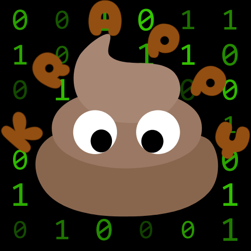

	<h1>Krappy</h1>

Customizable Discord bot template generator that supports multiple libraries.

 
 

# What is it?
> Krappy is a Discord bot **template** generator. It does ***NOT*** generate Discord bots. It just generates a codebase for a Discord bot, which is fancy talk for "it writes the boiler plate for a Discord bot".

---

# Why the name?
> Krappy is a joke name, mocking [Slappey](https://github.com/stuyy/slappey), the outdated `Discord.JS` template generator.

---

<!-- Helpful resource for finding libraries to support (if still updated and in a language commonly used): https://github.com/apacheli/discord-api-libs -->
# What libraries does it support?
| Library | Supported |
| --- | --- |
| [Discord.JS](https://old.discordjs.dev/#/) | ✅ |
| [Discord.py](https://discordpy.readthedocs.io/en/stable/) | ❌ |
| [Pycord](https://docs.pycord.dev/en/stable/) | ❌ |
| [Java Discord API](https://jda.wiki/introduction/jda/) | ❌ |
| [Concord](https://cogmasters.github.io/concord/) | ❌ |
| [DisCatSharp](https://docs.dcs.aitsys.dev) | ❌ |
| [DPP](https://dpp.dev) | ❌ |
### NOTE: This project is still in development, so this list will be updated as development goes on!
### NOTE: Discord.JS generation supports both TypeScript and JavaScript. If you use JS, you can choose between CJS (CommonJS) and ESM modules.
---

# How do I install it?
> You will be able to install it when it is released, so please be patient!
<!-- ### NOTE: You need `bash` or `zsh` to continue. If you're on Windows, install `Git for Windows` so you can use `bash`.
- ### Easy install (recommended)
> 1. Install the `.zip` folder that matches your system from releases.
> 2. Run `install.sh`.

- ### Build from source
> 1. Install [Python 3.12.0](https://www.python.org/downloads/release/python-3120/).
> 2. Install requirements (check `requirements.txt`).
> 3. Run `make compile`.
> 4. Add exact path to `bin/krappy` to `PATH`.
> 5. Run `krappy -h` to make sure it works. -->
